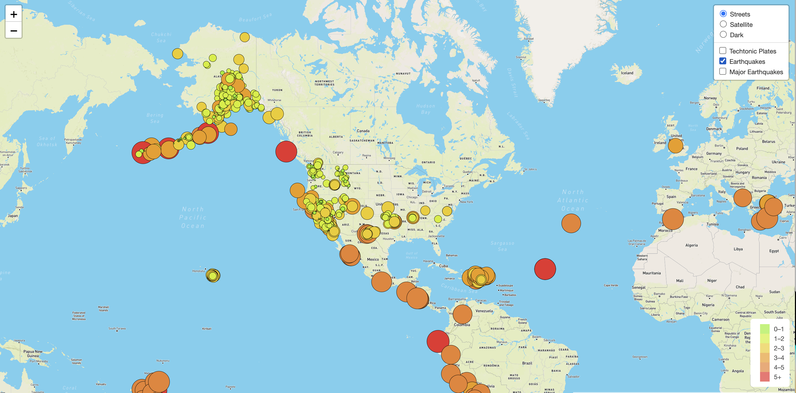
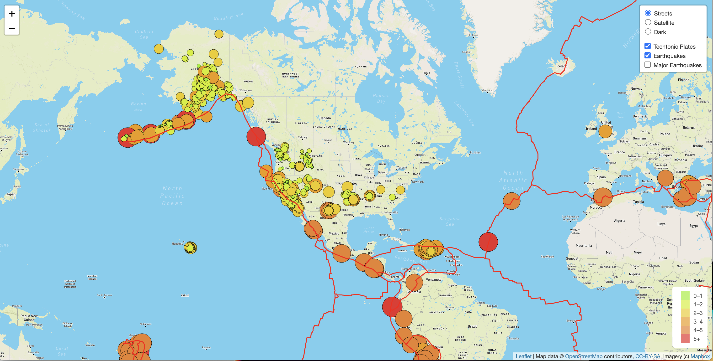
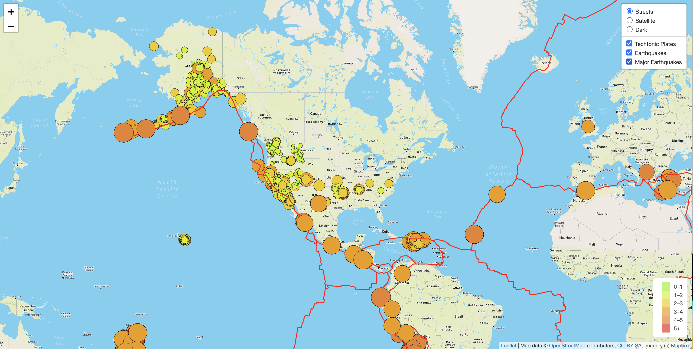
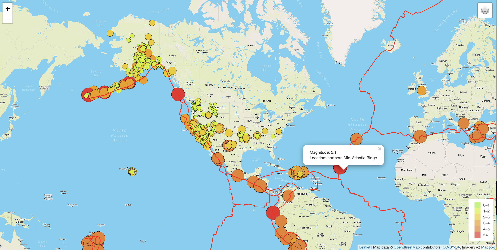
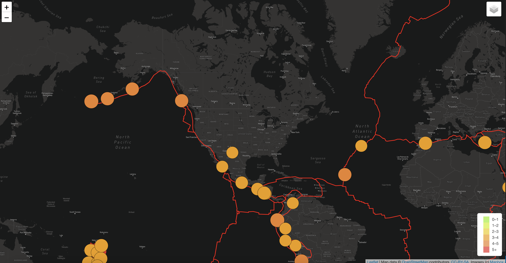

# Mapping-Earthquakes

## Overview
We have developed JavaScript code to to visually show the differences between the magnitudes of earthquakes all over the world for the last seven days. use A URL for GeoJSON earthquake data from the USGS website was used to retrieve geographical coordinates and the magnitudes of earthquakes for the last seven days. Then these data were added to a map. JavaScript and the D3.js library were used to retrieve the coordinates and magnitudes of the earthquakes from the GeoJSON data. The Leaflet library was used to plot the data on a Mapbox map through an API request.

**Software tools used**

  - JavaScript
  - JavaScript d3 library
  - VS Code
  - [Leaflet Mapping tools]([Earthquake_Challenge/static/images/earthquake-street.png](https://leafletjs.com/reference.html))
  - CSS
  - Git (and GitHub)
  - Web browser
  - Command-line interface

## Results

Earthquakes, techtonic plates, and major earthquakes were added as layers into the base map, which has three different views (street, satellite, and dark views). Thews views can be selected as needed. A legend with colors is visible to show the magnitude of the earthquakes. Figures 1-6 show dfferent views of earthquakes locations and magnitudes. 

**Figure 1.** Streepmap View of Earthquakes around the world. The size of the magnitude shows in color as well as size of the circle.

**Figure 2.** Streepmap View of Earthquakes around the world with tectonic plate markings

**Figure 3.** Streepmap View of Earthquakes around the world with major earth quakes highlighted as another layer.

**Figure 4.** Streepmap View of Earthquakes around the world with major a popup text highlighting the magnitude and the place.

**Figure 5.** Satellite View of Earthquakes around the world with a popup text highlighting the magnitude and the place.

**Figure 6.** Dark View of major earthquakes around the world with a popup text highlighting the magnitude and the place.

## Summary

We have successfully developed an interactive map to visualize earthquakes around the world. 
